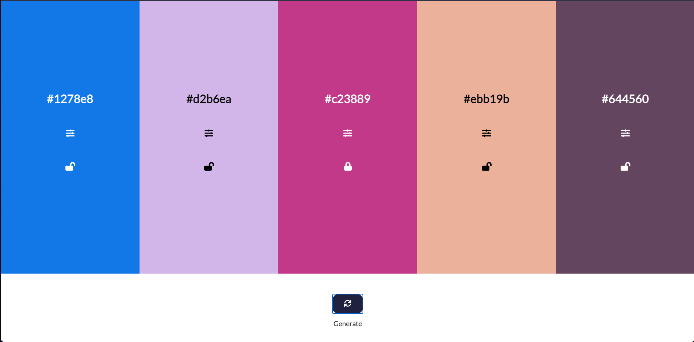
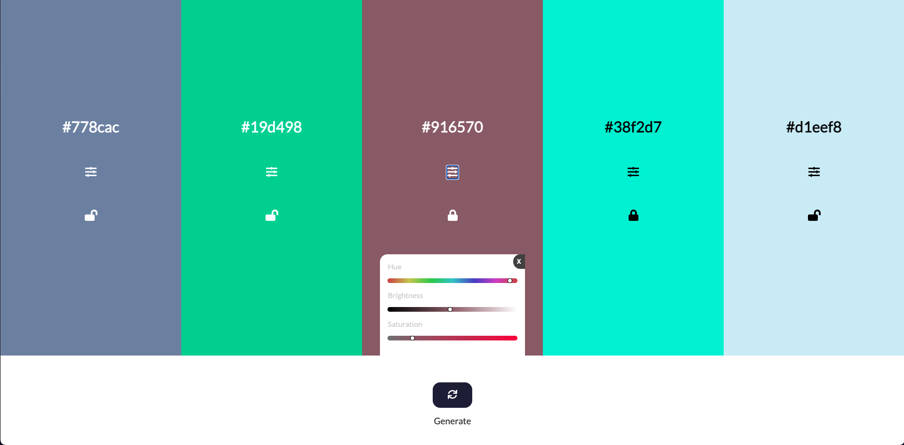

# JavaScript Colorfinder

Simple web app for selecting the right colors for your next project, coded in Vanilla.js with chroma.

You can visit the page here: [**Click me**](https://slawoe.github.io/js_colorfinder/)

---

### Example Screenshots

